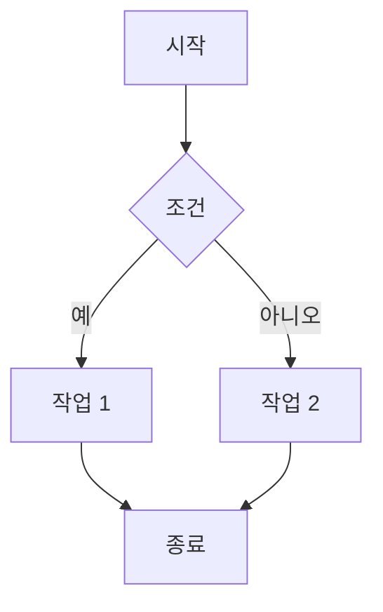

## Markdown이란?

Markdown은 일반 텍스트 기반의 경량 마크업 언어입니다. 읽기 쉽고 쓰기 쉬우며, HTML로 변환이 가능합니다.

## 제목 (Headings)

제목은 `#` 기호를 사용합니다:

```markdown
# H1 제목
## H2 제목
### H3 제목
#### H4 제목
```

## 텍스트 강조

다양한 방법으로 텍스트를 강조할 수 있습니다:

- **굵게** 또는 __굵게__: `**텍스트**` 또는 `__텍스트__`
- *기울임* 또는 _기울임_: `*텍스트*` 또는 `_텍스트_`
- ~~취소선~~: `~~텍스트~~`
- `인라인 코드`: `` `코드` ``

## 목록

### 순서 없는 목록

```markdown
- 항목 1
- 항목 2
  - 하위 항목 2.1
  - 하위 항목 2.2
- 항목 3
```

결과:
- 항목 1
- 항목 2
  - 하위 항목 2.1
  - 하위 항목 2.2
- 항목 3

### 순서 있는 목록

```markdown
1. 첫 번째
2. 두 번째
3. 세 번째
```

결과:
1. 첫 번째
2. 두 번째
3. 세 번째

## 링크

```markdown
[텍스트](URL)
[Google](https://www.google.com)
```

예제: [Google](https://www.google.com)

## 이미지

```markdown

```

## 코드 블록

### 인라인 코드

문장 안에 `코드`를 삽입할 수 있습니다.

### 코드 블록 (Syntax Highlighting)

언어를 지정하면 Syntax Highlighting이 적용됩니다:

**Python 예제:**

```python
def hello_world():
    print("Hello, World!")
    return True

if __name__ == "__main__":
    hello_world()
```

**JavaScript 예제:**

```javascript
function greet(name) {
  console.log(`Hello, ${name}!`);
  return true;
}

greet("World");
```

**JSON 예제:**

```json
{
  "name": "Jekyll Blog",
  "version": "1.0.0",
  "theme": "Chirpy"
}
```

## 인용구 (Blockquote)

```markdown
> 인용구는 이렇게 작성합니다.
> 여러 줄도 가능합니다.
```

결과:
> 인용구는 이렇게 작성합니다.
> 여러 줄도 가능합니다.

중첩된 인용구:
> 레벨 1
>> 레벨 2
>>> 레벨 3

## 표 (Table)

```markdown
| 헤더 1 | 헤더 2 | 헤더 3 |
|--------|--------|--------|
| 셀 1   | 셀 2   | 셀 3   |
| 셀 4   | 셀 5   | 셀 6   |
```

결과:

| 헤더 1 | 헤더 2 | 헤더 3 |
|--------|--------|--------|
| 셀 1   | 셀 2   | 셀 3   |
| 셀 4   | 셀 5   | 셀 6   |

정렬도 가능합니다:

| 왼쪽 정렬 | 가운데 정렬 | 오른쪽 정렬 |
|:---------|:----------:|----------:|
| 좌측     | 중앙       | 우측      |
| Left     | Center     | Right     |

## 수평선

```markdown
---
또는
***
```

결과:

---

## 체크리스트

```markdown
- [x] 완료된 항목
- [ ] 미완료 항목
- [ ] 진행 중
```

결과:
- [x] 완료된 항목
- [ ] 미완료 항목
- [ ] 진행 중

## 각주 (Footnotes)

```markdown
이것은 각주가 있는 문장입니다[^1].

[^1]: 이것은 각주입니다.
```

예제: 이것은 각주가 있는 문장입니다[^1].

[^1]: 이것은 각주 내용입니다.

## 수식 (MathJax)

Front Matter에서 `math: true`를 설정하면 수식을 사용할 수 있습니다:

```markdown
인라인 수식: $E = mc^2$

디스플레이 수식:
$$
\int_{a}^{b} f(x) dx
$$
```

## Mermaid 다이어그램

Front Matter에서 `mermaid: true`를 설정하면 다이어그램을 그릴 수 있습니다:



## 실전 팁

1. **일관성 유지**: 같은 스타일을 일관되게 사용하세요
2. **공백 활용**: 문단 사이에 빈 줄을 넣어 가독성을 높이세요
3. **미리보기**: 작성 중 미리보기를 자주 확인하세요
4. **이미지 최적화**: 이미지 크기를 적절히 조절하세요

## 결론

Markdown은 간단하지만 강력한 문법으로 구조화된 문서를 작성할 수 있게 해줍니다. 이 가이드를 참고하여 멋진 블로그 포스트를 작성해보세요!

---

**참고 자료:**
- [Markdown Guide](https://www.markdownguide.org/)
- [GitHub Flavored Markdown](https://github.github.com/gfm/)
- [Chirpy 테마 문서](https://chirpy.cotes.page/)
